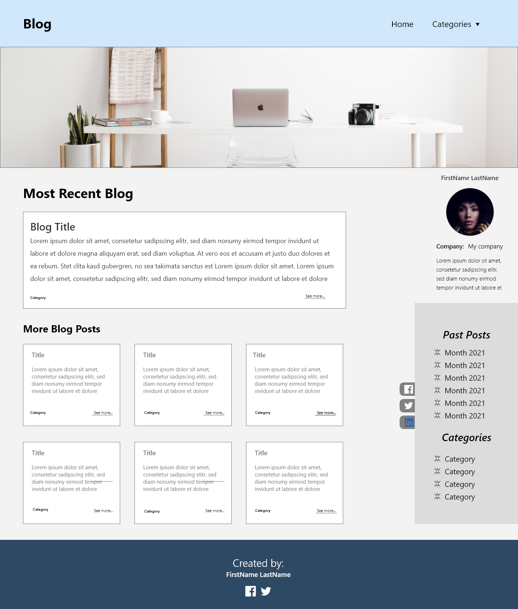
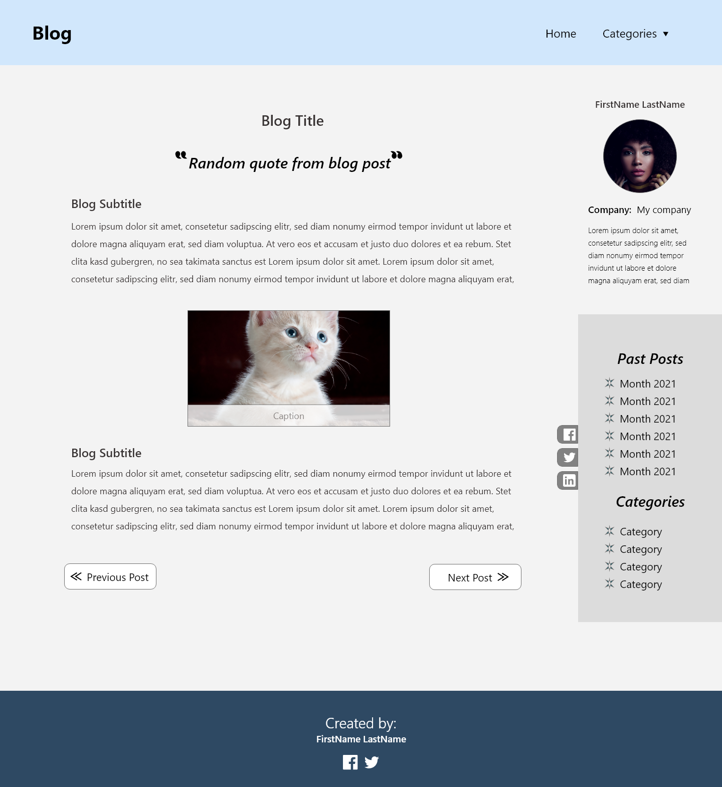
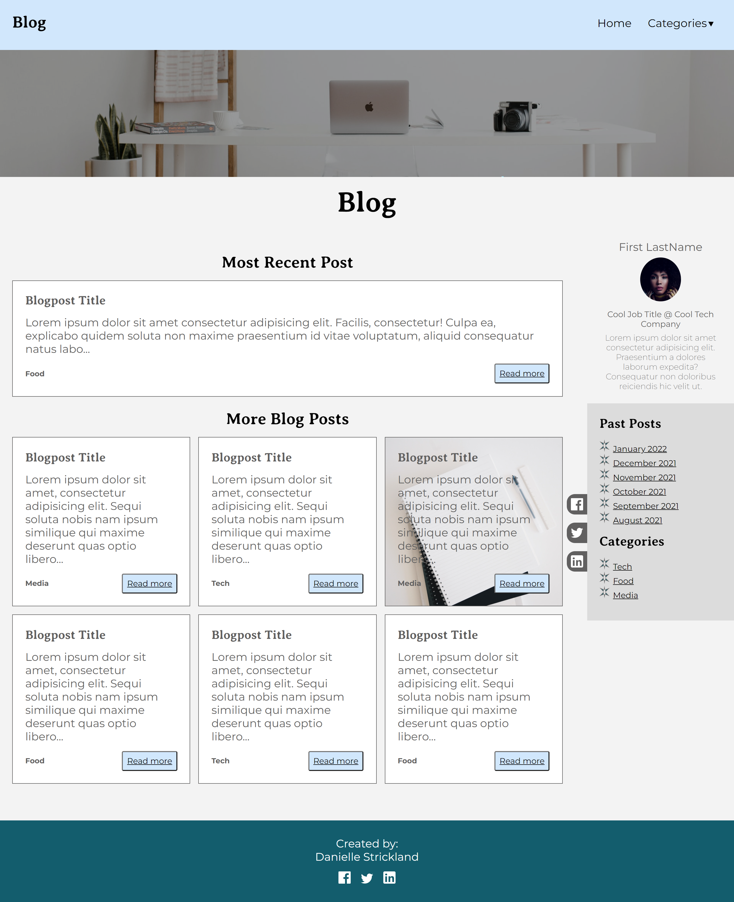
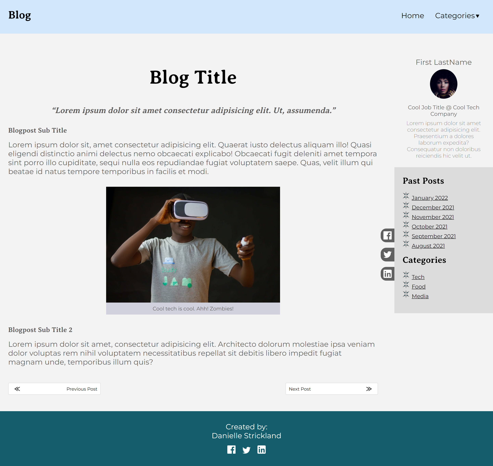

# Inventory Tracker and Shopping List

## Table of contents

- [Overview](#overview)
  - [The challenge](#the-challenge)
  - [Screenshot](#screenshot)
  - [Links](#links)
- [My process](#my-process)
  - [Built with](#built-with)
  - [What I learned](#what-i-learned)
  - [Challenges](#challenges)
  - [Continued development](#continued-development)
  - [Useful resources](#useful-resources)
- [Author](#author)

## Overview

### The challenge

In this project, you will be required to create a simple personal blog 
website using PLAIN HTML and CSS following proper formatting and style 
rules. No third-party libraries are allowed. The blog website will contain two 
pages: One is the home page, and the other is the page of a detailed blog.

##Requirements

#Structure
- CSS should be seperate from HTML
- CSS Imports - there should be at least 3 imported CSS files
- Directories & Files - Files are organized with a directory structure that seperates files based on page and functionality
- Links - There is an intentional user flow on each page with appropriate links as needed

#Design
- Custom Design
- Foundations
  - Typography: Custom design for typography with at least 3 unique properties for each typography selector
  - Colors: At least 3 colors used
- Components: page contains the following
  - Image(s)
  - Image caption
  - Buttons
  - Card
#Pattern
- The general pattern of the webpage should be as follows:
  - Blog Homepage
    - Navbar
    - Blogpost Card
      - Card
      - Image
      - Buttons
    - Footer
  - Blog Post
    - Header
    - Author Info
      - Name
      - Title
      - Current Company/School
      - Short Bio
      - Avatar
    - Social Media Sharing
- Pages
  - Blog homepage
  - Blog post

#Layout
- Flexbox used at least twice
- CSS Grid used at least twice

#Responsiveness
- Pages are mobile friendly and display correctly on all screen sizes

### Screenshot

**Original design**

**Finished product**

### Links

- Solution URL: [Github](https://github.com/dstrickl7/SEP_REACT_1_18_2022/tree/by_Danielle_Strickland/hw/project1)
- Live Site URL: [Mock Blog](https://dstrickl7.github.io/SEP_REACT_1_18_2022/project1/)

## My process

After reading the requirements, I created the design in Adobe XD. Once my design was finallized, I created the file structure. After the file structure, I created the html skeleton. Once the skeleton was created, I added content and began styling.

### Built with

- Semantic HTML5 markup
- CSS
- Mobile-first workflow
- JavaScript (ES6)
- Adobe XD

### What I learned

- BEM File Structure and naming convention
  - Learning this (although I'm still a little shaky with it) added the much needed organization structure and helped me create this page more efficiently than I've previously been able to.

### Challenges

- I'm not sure if this is related to the coding, but Google Chrome hiding the scroll bar really makes the page lack accessibility

### Useful resources

- [MDN Web Docs](https://developer.mozilla.org/en-US/) - My go-to resource for syntax and use examples

## Author

- Website - [Curly Coder](https://www.curlycoder.com)
- Github - [dstrickl7](https://github.com/dstrickl7)
